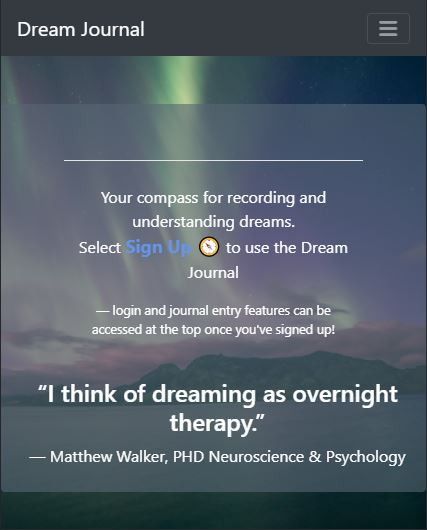

# Dream-Journal
This application assists a user in recording their dreams 

## Collaborators: 
Dani Reinholz, Wesley Bryant, Alan M Do, Jonny Martin

## Technologies used:
* HTML
* CSS
* Bootstrap
* JavaScript
* Express
* Sequelize
* Passport
* Moment.js
* Bcrypt
* Dotenv
* Cookie-Parser

## User Story
1. As a User, I want a secure way to record and track my dreams over time to see if there are any patterns or mysteries revealed.
2. When I click Add Journal Entry I would like to be prompted with questions like how I'm feeling, the title of the dream, and place to enter a full description. 
3. When I submit an entry I would like for a date tag to be added along with the title and emoji to past entries for later reference.
4. When I click on a past journal entry I would like to see the full dream details.

## Use at least one new library, package, or technology that we haven’t discussed.
* Cloudinary for save and using large images
* https://www.canva.com/ for color pallette in deciding page styling

## Link to live site:  
https://frozen-atoll-87689.herokuapp.com/

## Milestones:
1. Dani established CSS styling, routed emojis, captured and converted timestamps, added hamburger menu display, added favicon.
2. Wesley wrote the initial front end display for emoji selection.
3. Alen added font and styling to laptop, tablet, and mobile display.
4. Jonny added styling including the dream on button for journal entry submissions. 

## Challenges:

## Slides Deck:
https://docs.google.com/presentation/d/1Ij4jv1d8xdbHxyuyYKg2ZEDAgE2HcYcn08e-4G9azLU/edit?usp=sharing

